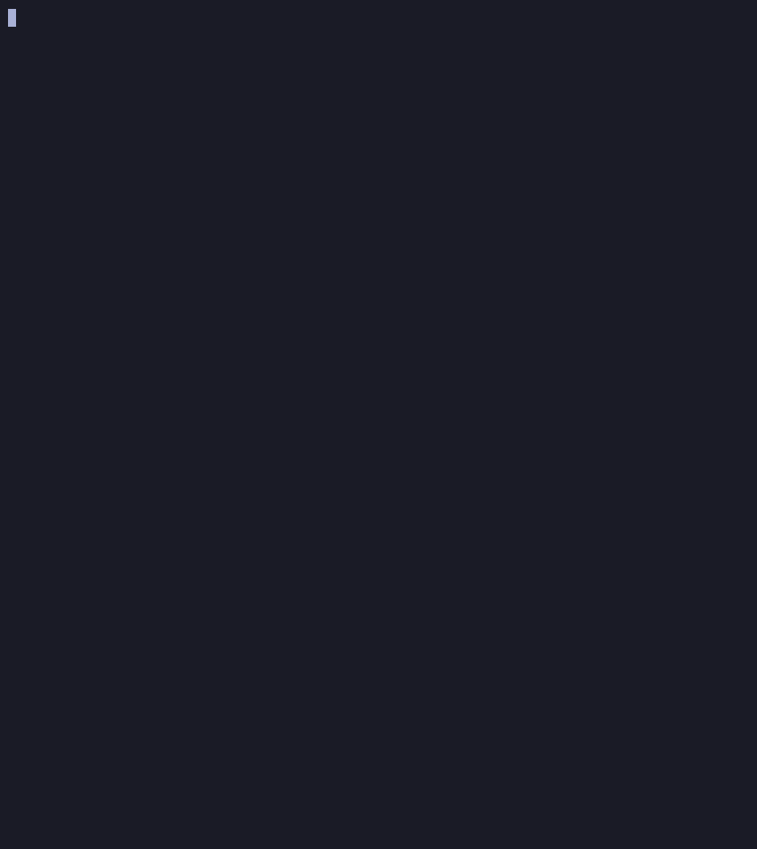
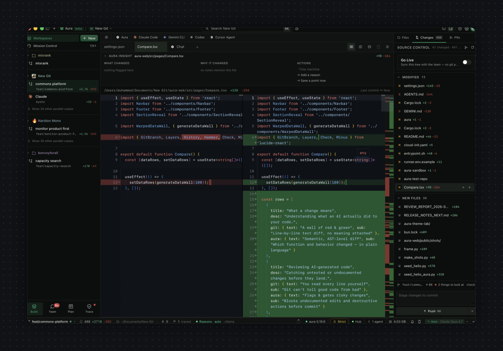

<p align="center">
  <a href="https://github.com/Naridon-Inc/aura/releases/latest"></a>
  <a href="LICENSE"></a>
  <a href="https://github.com/Naridon-Inc/aura/discussions"></a>
  
</p>

<h1 align="center">Aura</h1>

<p align="center">
<strong>An audit trail for what AI agents changed in your codebase, and why.</strong><br>
Signed, per commit, at the symbol level.
</p>

<p align="center">
  
  <br>
  <em>The agent said it would tune the retry backoff. It also deleted the token check. The commit does not land.</em>
</p>

## Quick start

```bash
curl -fsSL https://auravcs.com/install.sh | bash   # macOS · Linux · Windows
cd your-repo && aura init                          # installs the git hooks
```

That is the whole setup. From here every commit is parsed into logic nodes,
diffed at the AST level, and recorded with the intent that produced it. Ask
the repository about any file, or any line in one, months later:

```bash
aura why src/billing.rs
```

```
src/billing.rs

  Landed   a81c9e2  3d ago  ·  Ashiq
           fix(billing): stop tripping the Stripe rate limit

  Asked    "payments keep failing at peak, look at the retry path"
           claude · session 4f2a · 3d ago · named by the intent row

  Intent   "switch retry to exponential backoff so we stop tripping the
           Stripe rate limit"
           hook_auto · BugFix · logged while this commit was being written
```

Building from source instead: `cargo build --release` from the repository root.

<p align="center">
  
  <br>
  <em>The same record in the desktop app: every change carries the reason it was made and the agent that made it.</em>
</p>

## The problem it solves

Six agents committed to your repository this week. `git blame` says all six
commits were written by you, at 3am, with a message an agent generated. The
diff tells you which lines moved. Nothing tells you **which agent moved them,
what it was trying to do, or whether it did what it said it would.**

Aura records that. Four things fall out of it:

- **Provenance you can hand to an auditor.** Who or what changed each symbol,
  the stated reason, and a signature over both.
- **An intent gatekeeper.** The pre-commit hook compares your stated intent
  against the AST changes actually made. A commit that says *login* and
  touches *billing* is blocked before it lands.
- **Function-level rewind.** Revert one function to its last good state
  without unwinding the commit around it. It operates on AST nodes, so there
  are no merge conflicts.
- **Semantic review.** Layer violations, silent deletions and architectural
  drift, caught by diffing the graph rather than the text.

## How it works

Git versions **bytes**. Aura adds a second plane that versions **meaning**: a
graph of every function and class, the edges between them, and the intent and
provenance behind each change. Both planes live in your repository. No server
is required and nothing leaves your machine unless you configure cloud sync.

```
                         your repository
   ┌──────────────────────────────┬──────────────────────────────┐
   │   CODE PLANE  (git)           │   MEANING PLANE  (aura)        │
   │                               │                                │
   │   files · text diffs          │   AST Merkle-graph             │
   │   commits · branches   ◄────► │   logic nodes + call edges     │
   │   blobs · trees               │   intent · provenance          │
   │                               │   signed metadata refs         │
   └──────────────────────────────┴──────────────────────────────┘
              git hook ▶ parse AST ▶ diff nodes ▶ log intent ▶ prove goal
```

## One engine, three surfaces

This repository is the whole of Aura — a single Rust engine exposed three ways.
All three read and write the same `.aura/` meaning plane, so a change one agent
makes on the command line shows up, with full provenance, in the desktop app.

- **`aura` CLI** — git hooks, semantic review, function-level rewind, AI usage
  and cost tracking, the Crew work loop, and an MCP server.
  *([`src/`](src) + [`crates/`](crates))*
- **Desktop app** — a native Agentic Development Environment: many coding
  agents in one workspace, a Crew board, semantic review, rewind and a project
  timeline. macOS, Linux and Windows. *([`desktop/`](desktop))*
- **VS Code extension** — agent sessions, review and git surfaces inside VS
  Code. *([`extensions/vscode`](extensions/vscode))*

**[Read the full guide →](docs/guide.md)** — the desktop app, every capability,
the complete command reference and the Claude Code status line.

## FAQ

**Does this replace Git?** No. It is a layer on top of it. Your history, your
remotes and your workflow are untouched; Aura writes to `.aura/` and git notes.

**Does it work with agents other than Claude?** Yes — Claude Code, Gemini CLI,
Codex CLI, Kimi, Cursor and OpenCode are detected today, and the git-hook
capture path works with anything that commits.

**What if I do not run an agent at all?** The intent gatekeeper, rewind and
semantic review all work on human commits. The provenance simply says you.

**Does my code leave the machine?** Not unless you turn on cloud sync. See
[Privacy](#privacy) below.

## MCP Server

Aura exposes an MCP server for direct AI agent integration:

```json
{
  "mcpServers": {
    "aura-vcs": { "command": "aura", "args": ["mcp"] }
  }
}
```

30+ tools available including `aura_usage` (AI agents can self-monitor their own spend).

## Multi-Agent Support

Aura detects and tracks sessions from:
- **Claude Code** — MCP tools + status line + transcript parsing
- **Gemini CLI** — MCP server + hooks
- **Codex CLI** — session + transcript parsing
- **Kimi (Moonshot)** — OpenAI-compatible endpoint
- **Cursor** — workspace detection
- **OpenCode** — env vars and config

## Integrations

Guides for wiring Aura into specific agents and editors:

- [OpenCode](integrations/opencode.md) — quickstart via the git-hook capture path
- [Cursor](integrations/cursor.md) — semantic review + provenance alongside Cursor

## Supported Languages

Rust, Python, TypeScript, JavaScript, Go, Java, C#, C++, C, Ruby, PHP, Swift, Kotlin (13 languages via Tree-sitter).

## Privacy

- All data stored locally (`.aura/` + git notes)
- Telemetry opt-out: `AURA_TELEMETRY_OPTOUT=1` or `DO_NOT_TRACK=1`
- No data leaves your machine unless you configure cloud sync
- Usage tracking reads local Claude Code transcripts only — no API calls

## Repository layout

```
aura/
├─ src/            the `aura` CLI — the semantic engine's entrypoint
├─ crates/         the engine crates: AST diff/merge, attestation, plugin signing,
│                  the Crew work-loop, redaction, CRDT core, terminal engine, daemon, …
├─ desktop/        the desktop app (Tauri + React) — the ADE
├─ extensions/
│  └─ vscode/      the VS Code extension
├─ docs/           the full guide
├─ integrations/   editor / agent integration recipes
└─ tests/          end-to-end tests
```

The CLI and every crate build from the root workspace (`cargo build --release`). The
desktop app builds from [`desktop/`](desktop); the extension from [`extensions/vscode`](extensions/vscode).

## License

Apache License 2.0 — Copyright (c) 2026 Naridon, Inc.

Built by [Naridon, Inc.](https://naridon.com) in Switzerland.
